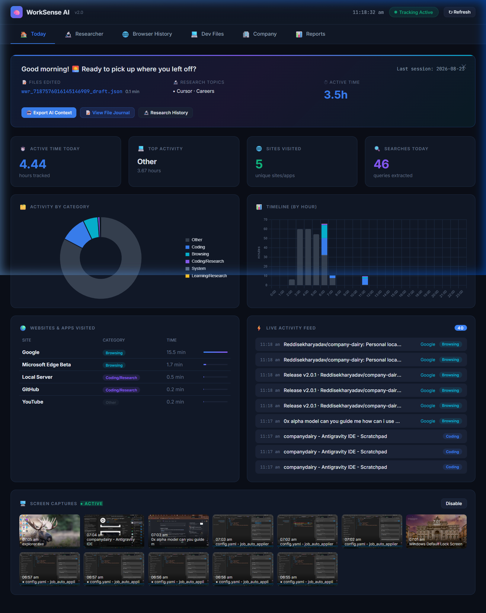
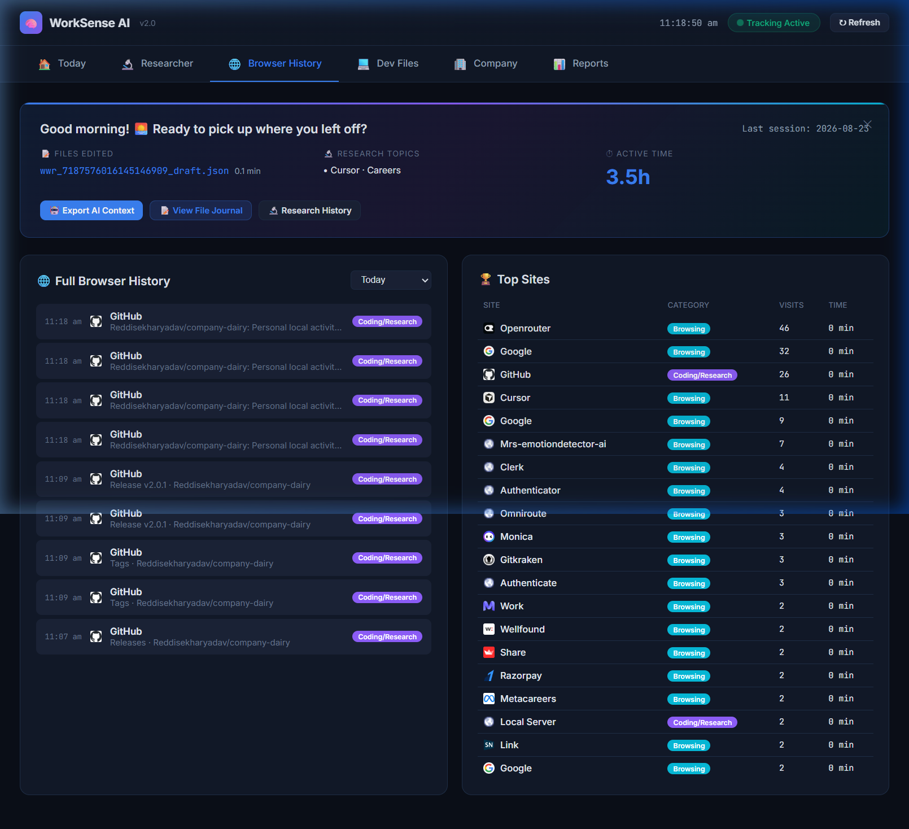
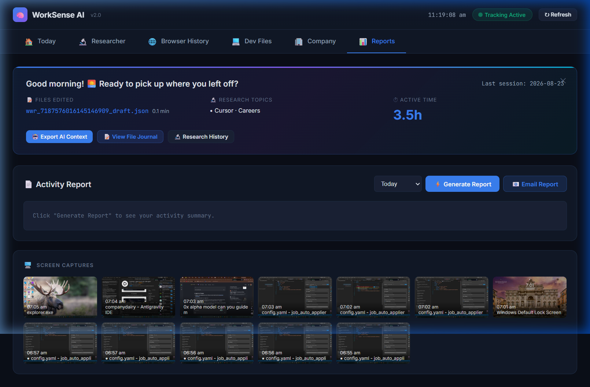

# WorkSense AI

**Intelligent Desktop Activity Tracker for Teams & Researchers**

[](https://github.com/Reddisekharyadav/company-dairy/actions)
[](https://github.com/Reddisekharyadav/company-dairy/releases/latest)
[](LICENSE)

> 🌐 **Website:** [https://reddisekharyadav.github.io/company-dairy/](https://reddisekharyadav.github.io/company-dairy/)
> 📂 **Portfolio:** [https://myportfolio.sekhar.tech/](https://myportfolio.sekhar.tech/)

---

## ✨ What is WorkSense?

WorkSense AI is a **privacy-first, offline desktop activity tracker** that runs silently in the background and generates detailed daily reports of what you worked on. Perfect for:

- 🏢 **Company research teams** tracking daily work
- 💻 **Developers** logging coding sessions & file edits
- 📊 **Managers** who need automatic daily reports from team members
- 🎓 **Interns** documenting their work for evaluations

**Everything runs locally on your machine — no cloud, no server, no account required.**

---

## 📸 Screenshots

| Dashboard | Browser History | Reports |
|:-:|:-:|:-:|
|  |  |  |

---

## 🚀 Features

| Feature | Description |
|---------|-------------|
| 🖥️ **Active Window Tracking** | Detects which app/window you are using, auto-categorized (Coding, Browsing, Communication, etc.) |
| 🌐 **Browser History** | Captures history from Chrome, Edge, and Firefox with URLs, titles, visit counts, and top sites |
| 💻 **Code File Tracking** | Tracks files edited in VS Code, JetBrains IDEs — languages, file paths, and time spent |
| 📸 **Screen Captures** | Periodic screenshots (with consent) for a visual timeline of your day |
| 📊 **Auto Reports** | Generates PDF, Markdown, and DOCX reports automatically at end of day |
| 📧 **Email Reports** | Optionally email daily reports to your manager/team via Gmail |
| 🔒 **100% Offline** | No cloud, no server, no account. All data stays on your computer |
| 🪟 **Floating Widget** | Always-on-top status pill with recording timer, port display, pause/resume, and minimize |
| 🖱️ **System Tray** | Full tray icon with right-click menu for all actions |

---

## ⬇️ Download

Download the latest standalone executable for your platform — **no Python, no dependencies, no setup required**:

| Platform | Download |
|----------|----------|
| 🪟 **Windows** | [WorkSense-Windows.exe](https://github.com/Reddisekharyadav/company-dairy/releases/latest/download/WorkSense-Windows.exe) |
| 🍎 **macOS** | [WorkSense-macOS](https://github.com/Reddisekharyadav/company-dairy/releases/latest/download/WorkSense-macOS) |
| 🐧 **Linux** | [WorkSense-Linux](https://github.com/Reddisekharyadav/company-dairy/releases/latest/download/WorkSense-Linux) |

> ⚠️ **Windows SmartScreen:** Since WorkSense is open-source and not signed with a paid certificate, Windows may show a SmartScreen warning. Click **"More info"** → **"Run anyway"**. The app is 100% safe — inspect the source code yourself!

---

## 🛠️ How It Works

```
┌──────────────┐     ┌──────────────────┐     ┌─────────────────┐
│  Background  │────▶│  SQLite Database │────▶│  Web Dashboard  │
│  Trackers    │     │  (local only)    │     │  localhost:5678  │
└──────────────┘     └──────────────────┘     └─────────────────┘
       │                                              │
       ▼                                              ▼
┌──────────────┐                              ┌─────────────────┐
│  System Tray │                              │  PDF/MD/DOCX    │
│  + Widget    │                              │  Reports        │
└──────────────┘                              └─────────────────┘
```

1. **Launch** — Double-click `WorkSense.exe`. It starts tracking immediately.
2. **Floating Widget** — A small pill appears in the top-right corner showing recording status, elapsed time, and the dashboard port (`:5678`). Click `›` to minimize it to a tiny dot.
3. **Dashboard** — Open `http://localhost:5678` in any browser to see real-time activity charts, browser history, code file edits, and more.
4. **Reports** — At 11:58 PM, WorkSense auto-generates a PDF report. You can also generate reports anytime from the widget or tray icon.
5. **Email** — Set Gmail App Password in environment variables and reports get emailed automatically.

---

---

## 🔒 Data Protection & Privacy

WorkSense is designed from the ground up to respect your privacy and protect your data.

- **100% Offline:** The application never makes outbound network requests to external servers. All data processing and report generation happens locally on your computer.
- **Local Storage:** All tracking data, browser history, and screenshots are stored securely in a local SQLite database (`events.db`) and a local `screenshots/` folder within the app directory.
- **Auto-Deletion (Data Retention):** To ensure your hard drive doesn't fill up and to protect old data, **WorkSense automatically deletes all database records and screenshots older than 30 days** every time it starts. Your historical data is naturally purged.
- **No Cloud Dependencies:** You do not need an account, and your activity is never uploaded anywhere unless you explicitly configure the SMTP emailer to send reports to your manager.

---

## 💻 OS-Specific Limitations

WorkSense supports Windows, macOS, and Linux, but due to varying OS security models, please note the following requirements:

### 🍎 macOS
macOS has strict security and privacy controls.
1. **Screen Recording Permission:** To capture periodic screenshots, macOS will prompt you to grant WorkSense "Screen Recording" permissions in *System Settings > Privacy & Security*. Without this, screenshots will be blank.
2. **Accessibility Permission:** To track the active window title, macOS requires you to grant "Accessibility" permissions to the app.
3. **Gatekeeper:** Since this is an open-source app and not signed with an Apple Developer ID, you must **Right-Click > Open** the app the first time to bypass the "Unidentified Developer" warning.

### 🐧 Linux
1. **Wayland vs X11:** WorkSense uses `xdotool` and `xprop` to track the active window. This works perfectly on **X11** sessions. However, on **Wayland** (the default on newer Ubuntu/Fedora releases), the strict security model prevents apps from reading other window titles. For full tracking, you must log in to an X11 session.
2. **Execution:** Ensure the downloaded binary is marked as executable (`chmod +x WorkSense-Linux`).

### 🪟 Windows
1. **SmartScreen Warning:** Windows Defender SmartScreen will flag the `.exe` as an "Unrecognized app" because it is not signed with an Extended Validation (EV) Code Signing certificate. Click **"More info"** → **"Run anyway"** to bypass it.

---

## 🔧 Development Setup

```bash
# Clone
git clone https://github.com/Reddisekharyadav/company-dairy.git
cd company-dairy

# Create virtual environment
python -m venv venv
venv\Scripts\activate        # Windows
source venv/bin/activate     # macOS/Linux

# Install dependencies
pip install -r requirements.txt

# Run
python main.py
```

### Build Standalone Executable

```bash
pip install pyinstaller
pyinstaller worksense_onefile.spec --noconfirm --clean
# Output: dist/WorkSense.exe
```

---

## 📧 Email Configuration

To enable automatic email reports, set these environment variables:

```
WS_EMAIL_TO   = recipient@example.com
WS_EMAIL_USER = you@gmail.com
WS_EMAIL_PASS = xxxx xxxx xxxx xxxx   (Gmail App Password)
WS_EMAIL_SMTP = smtp.gmail.com        (optional, default)
WS_EMAIL_PORT = 587                   (optional, default)
```

---

## 📁 Project Structure

```
companydairy/
├── main.py                  # Entry point — tray icon, widget, server
├── backend/
│   ├── app.py               # FastAPI web dashboard
│   └── templates/index.html # Dashboard UI
├── tracker/
│   ├── active_window.py     # Window detection (cross-platform)
│   ├── browser_history.py   # Chrome/Edge/Firefox history scraper
│   ├── categorizer.py       # Activity categorization
│   └── tracker.py           # Main tracking loop
├── database/
│   ├── models.py            # SQLAlchemy models
│   └── session.py           # Database session management
├── reports/
│   ├── generator.py         # PDF/MD/DOCX report generation
│   └── emailer.py           # Email sending
├── ui/
│   └── status_widget.py     # Floating widget + consent dialog
├── docs/
│   ├── index.html           # Showcase website
│   └── screenshots/         # Live screenshots
├── .github/workflows/
│   └── desktop.yml          # CI/CD for multi-platform builds
├── worksense_onefile.spec   # PyInstaller spec
└── requirements.txt
```

---

## 🔗 Links

- 🌐 **Website:** [https://reddisekharyadav.github.io/company-dairy/](https://reddisekharyadav.github.io/company-dairy/)
- 📂 **Releases:** [Download Latest](https://github.com/Reddisekharyadav/company-dairy/releases/latest)
- 👤 **Portfolio:** [https://myportfolio.sekhar.tech/](https://myportfolio.sekhar.tech/)
- 💻 **GitHub:** [Reddisekharyadav](https://github.com/Reddisekharyadav)

---

## 📄 License

MIT License — see [LICENSE](LICENSE) for details.

**Built with ❤️ by [Reddi Sekhar Yadav](https://myportfolio.sekhar.tech/)**
